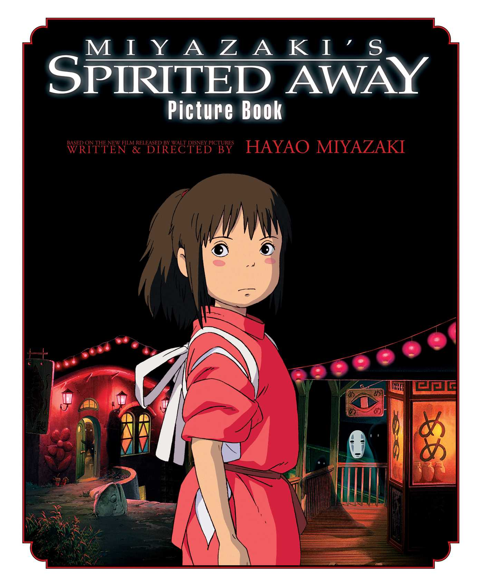

This category covers Studio Ghibli films, their stories, themes, and artistic style.

## Spirited Away Feature

*Spirited Away* is one of Studio Ghibli’s most well-known films, directed by Hayao Miyazaki. The movie is remembered for its imaginative world, emotional storytelling, and detailed visual design. Chihiro’s journey through the spirit world shows many of the themes that make Studio Ghibli films so memorable, including courage, identity, and personal growth.

## PDF Resource

[Spirited Away Study Guide](../assets/SpiritedAway.pdf)